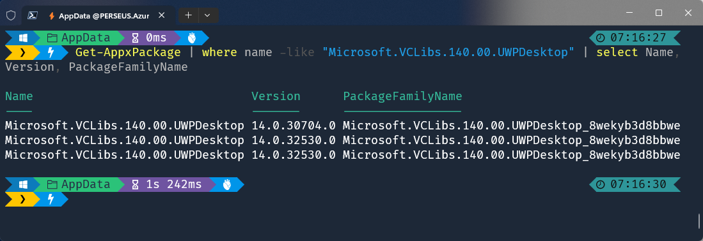
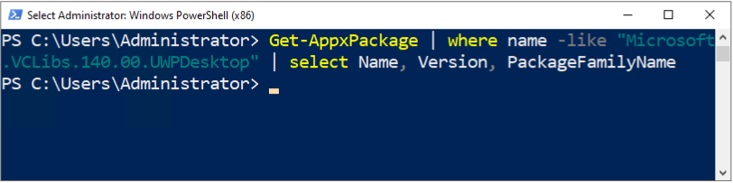
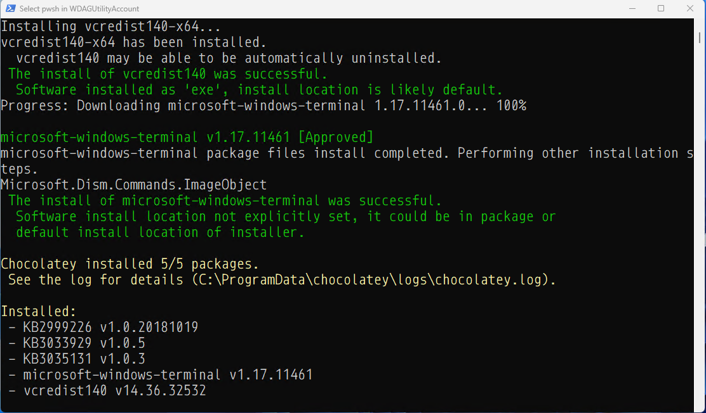
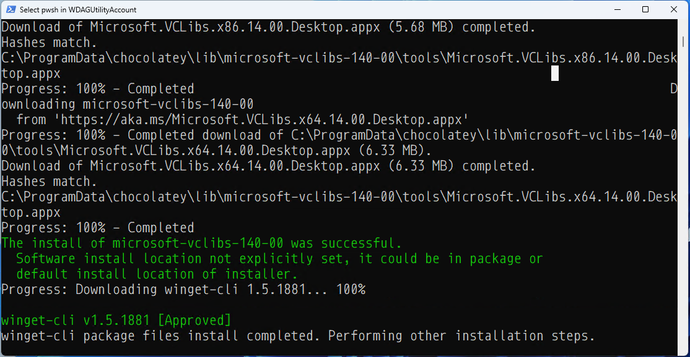
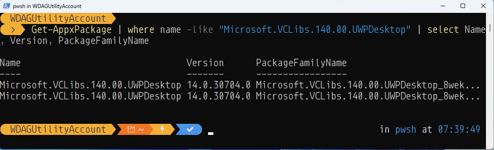

# VCLibs (C++ Runtime framework packages for Desktop Bridge)

    

## Summary

Desktop Bridge (formerly called *Project Centennial* or *Desktop Conversion Extensions*; now usually called *Windows Desktop Extensions for the UW*) can package desktop applications as an MSIX package that can be deployed to a Windows 10/11 Desktop. After creating an MSIX package for your desktop app, the developer can use UWP APIs, package extensions, and UWP components to light up modern and engaging Windows 10/11 experiences such as live tiles and notifications, but also to integrate with the system (e.g. establish firewall rules).

    

* See more functions at: https://learn.microsoft.com/en-us/windows/apps/desktop/modernize/desktop-to-uwp-enhance
* See setup instructions at: https://learn.microsoft.com/en-us/windows/apps/desktop/modernize/desktop-to-uwp-extend

## The Issue

Windows desktop applications that have a dependency on the C++ Runtime libraries must specify the corresponding version of the C++ Runtime framework package for Desktop Bridge during creation of the application package.

Some Windows 10/11 experiences (e.g. a touch-enabled UI page) must run inside of a modern app container. Windows desktop applications that run in a Desktop Bridge container cannot use the C++ Runtime libraries that are included with Visual Studio or VCRedist.

An application that's running in a Desktop Bridge container and that uses an incorrect version of the C++ runtime libraries might therefore fail when it tries to access resources such as the file system or the registry. Alternatively, the latest VCLibs runtime might not be installed.

Such applications notably include Windows Terminal and Microsoft winget.

Error messages will usually read like this:

> Windows cannot install package Microsoft.WindowsTerminal_1.13.11431.0_x64__8wekyb3d8bbwe because this package depends on a framework that could not be found. Provide the framework "Microsoft.VCLibs.140.00.UWPDesktop" published by "CN=Microsoft Corporation, O=Microsoft Corporation, L=Redmond, S=Washington, C=US", with neutral or x64 processor architecture and minimum version 14.0.30035.0, along with this package to install.


While the issue now rarely occurs if the Windows 10/11 system in question is up to date or the Microsoft Store installation is bricked, the problem occurs on Windows Server and the Sandbox on Windows 10/11 as they do not come with the store and the runtime packages installed.

## Find the installed version

To tell if the correct C++ framework runtime library is install, run the following:

```
Get-AppxPackage | where name -like "Microsoft.VCLibs.140.00.UWPDesktop" | select Name, Version, PackageFamilyName
```

Windows 11 will return several version installed:



Windows Server 2022, Windows Server 2022 vNext (to become 2025) and Windows 10/11 Sandbox retun no results:



## Solutions

### Solution 1: Chocolatey (Recommended)

Installing Terminal through Chocolatey seems to get around the VCLibs missing problem by installing VCRedist, but its successs seems to be hit and miss.



However, while the Terminal latest version was installed without any errors, the app would not actually start. Clicking on its icon, would achieve nothing.

Installing Winget through Chocolatey seems to go in the right way and install the missing VCLibs framework first.





The latest version of winget was succesfully installed and now, because of the newly installed VCLibs, Terminal started working too.

#### VCLibs

While writing this guide, Chocolatey added VCLibs as a separate package on its Community Repository. Therefore you don't need to install WinGet anymore if you just want the Terminal (or some other app) working. Just run:

```
choco install microsoft-vclibs -y
```

**Note that this package is updated manually, therefore it might not always hold the latest version. Read Solution 2 for a way to solve that problem.**

> If you're looking for instructions on how to install and use Chocolatey, see my dedicated repo at: https://github.com/gabriel-vanca/Chocolatey

If you still want to install WinGet and Terminal, read below.

#### WinGet

```
choco install winget-cli -y
```

Note that this will also install VCLibs if you haven't already installed it.

#### Terminal

Make sure VCLibs is installed first by either installing the VCLibs package directly as indicated above, or at the same time as WinGet.

Terminal can then be installed either via Chocolatey or via WinGet

##### via Chocolatey

```
choco install microsoft-windows-terminal -y
```

##### via WinGet

⚠️ The WinGet install option seems to fail in Windows Sandbox. The Chocolatey install version works correctly.

```
winget install --id=Microsoft.WindowsTerminal  -e
```

### Solution 2: Direct Install

If you do not want to install or rely on Chocolatey, you can use the script I have written to download and install VCLibs.

To install it, run:

```
$installScript =  Invoke-RestMethod https://raw.githubusercontent.com/gabriel-vanca/VCLibs/main/Deploy_MS_VCLibs.ps1
Invoke-Expression $installScript
```

🪟This deployment solution was tested on:

* ✅Windows 10
* ✅Windows 11
* ✅Windows 11 Sandbox
* ✅Windows Server 2019
* ✅Windows Server 2022
* ✅Windows Server 2022 vNext (Windows Server 2025)

⚠️ In a small number of attempts when running in Windows 11 Sandbox, installing the VCLibs via this method and then installing Terminal via Chocolatey would result in Terminal failing to start, while installing Terminal via WinGet would would perfectly fine.

To force reinstall (not recommended), you can run the following:

```
$installScript = Invoke-RestMethod https://raw.githubusercontent.com/gabriel-vanca/VCLibs/main/Deploy_MS_VCLibs.ps1
$installScript_sb = [Scriptblock]::Create($installScript)
Invoke-Command -ScriptBlock $installScript_sb -ArgumentList [$True] -NoNewScope
```
